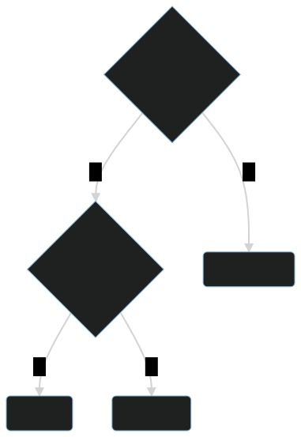

# 序章

中文 | [English](https://doc.tmoe.me/en/prologue.html)

- [問與答](#問與答)
  - [我是否應該閲讀這本書？](#我是否應該閲讀這本書)
  - [如何閲讀這本書](#如何閲讀這本書)
- [關於天萌的使用](#關於天萌的使用)
- [聲明](#聲明)
  - [許可證](#許可證)
- [交流與討論](#交流與討論)
  - [問題反饋](#問題反饋)
- [尾聲](#尾聲)

> 下文將用“本書”來代指“本手冊”。

## 問與答

### 我是否應該閲讀這本書？

```mermaid
graph TD
    A{您是天萌的用户嗎} --> |否| B{您打算使用天萌嗎}
    B --> |否| D(不用看了)
    B --> |是| E(簡單看一下)
    A --> |是|C(有必要去閲讀)
```

### 如何閲讀這本書

在閲讀本書時，您需要了解的內容。

- 左上角的三條槓 "≡"
  - 點擊三條槓打開目錄
- 頁面最下方的評論區
  - 您可以使用 github 帳號登錄，您發表的內容將與 "github discussions" 保持同步。同理，如果您在 discussions 中找到當前章節的討論頁面，並在裏面發表內容，那麼相關內容也會同步到下方的評論區。
- 左上角的畫筆 "🖌️"
  - 先點擊畫筆，再選擇主題，最後完成切換
- 左下角的 "<" 符號
  - 點擊 "<" 跳轉到上一頁
- 右下角的 ">" 符號
  - 點擊 ">" 跳轉到下一頁

> 如果您的網頁（屏幕）顯示空間足夠寬，那麼"<" 和 ">" 將位於中間，而不是下方。

## 關於天萌的使用

從 edition 2022 開始，對於某些功能或工具，天萌的開發者如果沒有把它打成包（例如 deb 包），並且沒有在本書中對其進行詳細解析。  
那麼不建議您在宿主環境下使用相關功能，只建議您在容器中使用。

> 對於 edition 2021 的所有功能，“二萌” 只建議您在容器中使用。  
> 對於 edition 2021 中無法在容器中使用的部分功能，您可以在虛擬機中測試。

您如果對一個功能不夠了解，那麼會去使用它嗎？  
或許會，但是您可能不會去信任它。

“天萌” 也是一樣的。  
“天萌” 只是一個第三方項目，正如有些人所説的：“它不出問題才奇怪呢？”  
這句話讓“二萌”非常非常傷心，難過到要哭了。

edition 2022 其實已經來了，雖然只有一小部分，但是它可能與您預想的形式完全不一樣。  
在本書的 repo 篇中，“二萌”將為您詳細解析一些小功能的作用。  
至於是否使用它，以及它是否存在價值，這取決於您的看法。

無論如何，“二萌”都希望您在瞭解完相關功能後，再去使用它，而不是盲目去用。

悄悄埋個伏筆，本書將在 repo 篇中介紹一個對於 debian 和 ubuntu 來説，可能有點用的小功能。  
您可能會用到這個小功能，但是不一定能猜到這個小功能被 “二萌” 拆成了數百個 deb 包。

## 聲明

在本書中，“天萌” 對應 "tmoe"；  
“二萌” 對應 "2moe"。  
“二萌” 沒有為 "tmoe" 相關的東西註冊商標。  
如果相關名稱或內容侵害了您的權益，請聯繫 “二萌” 進行修改。

### 許可證

“天萌” 只是一個小小的開源項目，“二萌” 並沒有充足的資金和良好的心理狀態去承擔“侵權”帶來的法律責任。

> “天萌” 是一個項目，“二萌” 是一個有生命的個體。

“天萌”之前之所以使用如此嚴格的許可證，就是因為“二萌”擔心各種各樣的法律問題。

從 2022-05-12 開始，“二萌” 將“天萌” 的許可證更換為 “Apache-2.0”，並刪除了之前的私有協議和 "GPL-2.0+"。  
對於“天萌”調用的外部項目，如果存在衝突許可證，那麼 “二萌” 會將其拆成外部的包。

“天萌” 的 “documentation(文檔)” 使用 "CC-BY-4.0"，“非 doc” 使用 "Apache-2.0"。  
“天萌” 調用的外部項目，使用它們各自的協議，詳見項目根目錄下的 "Copyright" 文件。

如果相關許可證沒有衝突的話， 那麼您可以在商業項目中調用 “天萌”。  
~~二萌很窮很窮的，嗚嗚，如果您用天萌賺到錢了，希望能給二萌或者是天萌的其他開發者一點點~~

> 從理論上來説，對於一般的許可證，只要取得了所有貢獻者的同意，那麼就可以換許可證。  
> 如果相關貢獻者不同意更換，那麼很簡單，把他們貢獻過的代碼都刪掉或重寫就可以了。

## 交流與討論

如果您有什麼奇思妙想，可以在評論區裏告訴“二萌”，也可以提交 issue。  
有個情況是個例外。  
假設您想要增加一個上游幾乎停止維護的系統到“天萌”的容器列表，對於這種情況，就算您直接提交 PR, “二萌”也不太想接。（其他 PR 還是很樂意接受的。）

曾經有個人説過這樣一句話：“軟件包不能有太多錯誤，以至於我們拒絕維護它。”  
“二萌” 雖然不知道這句話是誰説的，但是覺得它很有道理。

### 問題反饋

先來看一個流程圖

```mermaid
graph TD
    A[出門買東西] --> |走在路上| B{看到一隻小貓咪}
    B --> C{修貓咪,嘿嘿,我的修貓咪}
    B --> D{哦,是貓呀}
    B --> E{什麼東西?}
    B --> F(與我無關)
    F --> G(默默路過)
    D --> H{注意到貓咪受傷了}
    C --> H
    E --> H
```

不好意思，好像放錯圖了。  
~~因為二萌懶得再畫新圖了，所以就用這張吧~~

如果沒有人知道這隻貓咪受傷了，或者大家都知道，只是不想去管它，那麼它可能幾天後就前往喵星了。  
(其實這隻貓是外星的喵，它受傷只是偽裝，真正的目的是潛伏在地球，執行一些機密任務 QwQ)

還有可能，這隻貓憑藉着自身頑強的生命力，自愈了。

再做個假設，假設您很有愛心，想要救貓貓。  
您想要靠近貓貓，可是貓貓對您哈氣，它不肯讓陌生人接近。  
於是您跑到五金店裏買了籠子，然後費勁千辛萬苦，抓到了這隻貓。  
最後您把這隻貓送到了附近的 xx 人民醫院，或者是 xx 小診所。  
有些大醫院裏可能會有獸醫，或者是獸藥。  
可是您去的那家剛好沒有。  
而且附近既沒有寵物救助站，也沒有寵物醫院。  
那怎麼辦呢？  
能在人類的醫院給貓咪掛號嗎？

> 本故事純屬虛構，如有雷同，純屬巧合。

很久之前，無論您在 “天萌” 的 issue 區裏問什麼問題，“二萌” 都會想辦法回答您，很少有不回覆的情況。  
但是現在，“二萌” 變了，變壞了，變得不想回答問題了。  
嗚喵，對於與本項目無關的話題，其實您還是可以放在 “discussions” 裏的，不過“二萌”可能連小“貓病”都治不好。

## 尾聲

至此，序章正式完結。  
在之後的篇章中，我們將為您揭開“她”的層層面紗，一步一步帶您領略其中的魅力。

> 點擊右下角的 **>** 符號，開啓新的篇章。
