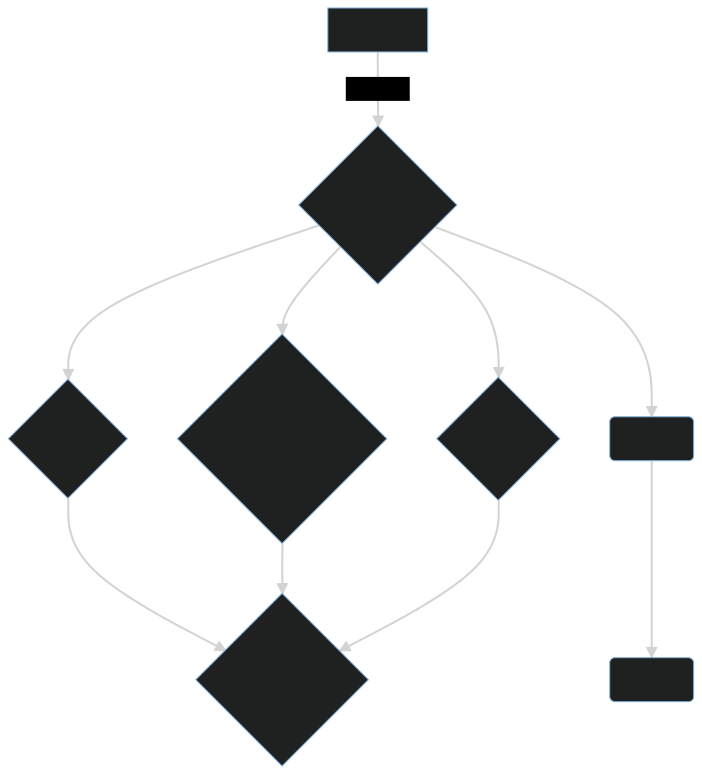

# 序章

- [问与答](#问与答)
  - [我是否应该阅读这本书？](#我是否应该阅读这本书)
  - [如何阅读这本书](#如何阅读这本书)
- [关于天萌的使用](#关于天萌的使用)
- [声明](#声明)
  - [许可证](#许可证)
- [交流与讨论](#交流与讨论)
  - [问题反馈](#问题反馈)

> 下文将用“本书”来代指“本手册”。

## 问与答

### 我是否应该阅读这本书？

```mermaid
graph TD
    A{您是天萌的用户吗} --> |否| B{您打算使用天萌吗}
    B --> |否| D(不用看了)
    B --> |是| E(简单看一下)
    A --> |是|C(有必要去阅读)
```

### 如何阅读这本书

在阅读本书时，您需要了解的内容。

- 左上角的三条杠 "≡"
  - 点击三条杠打开目录
- 页面最下方的评论区
  - 您可以使用 github 帐号登录，您发表的内容将与 "github discussions" 保持同步。同理，如果您在 discussions 中找到当前章节的讨论页面，并在里面发表内容，那么相关内容也会同步到下方的评论区。
- 左上角的画笔 "🖌️"
  - 先点击画笔，再选择主题，最后完成切换
- 左下角的 "<" 符号
  - 点击 "<" 跳转到上一页
- 右下角的 ">" 符号
  - 点击 ">" 跳转到下一页

> 如果您的网页（屏幕）显示空间足够宽，那么"<" 和 ">" 将位于中间，而不是下方。

## 关于天萌的使用

从 edition 2022 开始，对于某些功能或工具，天萌的开发者如果没有把它打成包（例如 deb 包），并且没有在本书中对其进行详细解析。  
那么不建议您在宿主环境下使用相关功能，只建议您在容器中使用。

> 对于 edition 2021 的所有功能，“二萌” 只建议您在容器中使用。  
> 对于 edition 2021 中无法在容器中使用的部分功能，您可以在虚拟机中测试。

您如果对一个功能不够了解，那么会去使用它吗？  
或许会，但是您可能不会去信任它。

“天萌” 也是一样的。  
“天萌” 只是一个第三方项目，正如有些人所说的：“它不出问题才奇怪呢？”  
这句话让“二萌”非常非常伤心，难过到要哭了。

edition 2022 其实已经来了，虽然只有一小部分，但是它可能与您预想的形式完全不一样。  
在本书的 repo 篇中，“二萌”将为您详细解析一些小功能的作用。  
至于是否使用它，以及它是否存在价值，这取决于您的看法。

无论如何，“二萌”都希望您在了解完相关功能后，再去使用它，而不是盲目去用。

悄悄埋个伏笔，本书将在 repo 篇中介绍一个对于 debian 和 ubuntu 来说，可能有点用的小功能。  
您可能会用到这个小功能，但是不一定能猜到这个小功能被 “二萌” 拆成了数百个 deb 包。

## 声明

在本书中，“天萌” 对应 "tmoe"；  
“二萌” 对应 "2moe"。  
“二萌” 没有为 "tmoe" 相关的东西注册商标。  
如果相关名称或内容侵害了您的权益，请联系 “二萌” 进行修改。

### 许可证

“天萌” 只是一个小小的开源项目，“二萌” 并没有充足的资金和良好的心理状态去承担“侵权”带来的法律责任。

> “天萌” 是一个项目，“二萌” 是一个有生命的个体。  
> “二萌” 不是草木，更不是地外生物。如果您骂得太过分的话，“二萌”心里会很难过的。

“天萌”之前之所以使用如此严格的许可证，就是因为“二萌”担心各种各样的法律问题。

从 2022-05-12 开始，“二萌” 将“天萌” 的许可证更换为 “Apache-2.0”，并删除了之前的私有协议和 "GPL-2.0+"。  
对于“天萌”调用的外部项目，如果存在冲突许可证，那么 “二萌” 会将其拆成外部的包。

“天萌” 的 “documentation(文档)” 使用 "CC-BY-4.0"，“非 doc” 使用 "Apache-2.0"。  
“天萌” 调用的外部项目，使用它们各自的协议，详见项目根目录下的 "Copyright" 文件。

如果相关许可证没有冲突的话， 那么您可以在商业项目中调用 “天萌”。  
~~二萌很穷很穷的，呜呜，如果您用天萌赚到钱了，希望能给二萌或者是天萌的其他开发者一点点~~

> 从理论上来说，对于一般的许可证，只要取得了所有贡献者的同意，那么就可以换许可证。  
> 如果相关贡献者不同意更换，那么很简单，把他们贡献过的代码都删掉或重写就可以了。

## 交流与讨论

如果您有什么奇思妙想，可以在评论区里告诉“二萌”，也可以提交 issue。  
有个情况是个例外。  
假设您想要增加一个上游几乎停止维护的系统到“天萌”的容器列表，对于这种情况，就算您直接提交 PR, “二萌”也不太想接。（其他 PR 还是很乐意接受的。）

曾经有个人说过这样一句话：“软件包不能有太多错误，以至于我们拒绝维护它。”  
“二萌” 虽然不知道这句话是谁说的，但是觉得它很有道理。

### 问题反馈

先来看一个流程图

```mermaid
graph TD
    A[出门买东西] --> |走在路上| B{看到一只小猫咪}
    B --> C{修猫咪,嘿嘿,我的修猫咪}
    B --> D{哦,是猫呀}
    B --> E{什么东西?}
    B --> F(与我无关)
    F --> G(默默路过)
    D --> H{注意到猫咪受伤了}
    C --> H
    E --> H
```

不好意思，好像放错图了。  
~~因为二萌懒得再画新图了，所以就用这张吧~~

如果没有人知道这只猫咪受伤了，或者大家都知道，只是不想去管它，那么它可能几天后就前往喵星了。  
(其实这只猫是外星的喵，它受伤只是伪装，真正的目的是潜伏在地球，执行一些机密任务 QwQ)

还有可能，这只猫凭借着自身顽强的生命力，自愈了。

再做个假设，假设您很有爱心，想要救猫猫。  
您想要靠近猫猫，可是猫猫对您哈气，它不肯让陌生人接近。  
于是您跑到五金店里买了笼子，然后费劲千辛万苦，抓到了这只猫。  
最后您把这只猫送到了附近的 xx 人民医院，或者是 xx 小诊所。  
有些大医院里可能会有兽医，或者是兽药。  
可是您去的那家刚好没有。  
而且附近既没有宠物救助站，也没有宠物医院。  
那怎么办呢？  
能在人类的医院给猫咪挂号吗？

> 本故事纯属虚构，如有雷同，纯属巧合。

很久之前，无论您在 “天萌” 的 issue 区里问什么问题，“二萌” 都会想办法回答您，很少有不回复的情况。  
但是现在，“二萌” 变了，变坏了，变得不想回答问题了。  
呜喵，对于与本项目无关的话题，其实您可以放在 “discussions” 里的，不过“二萌”可能连小“猫病”都治不好。
